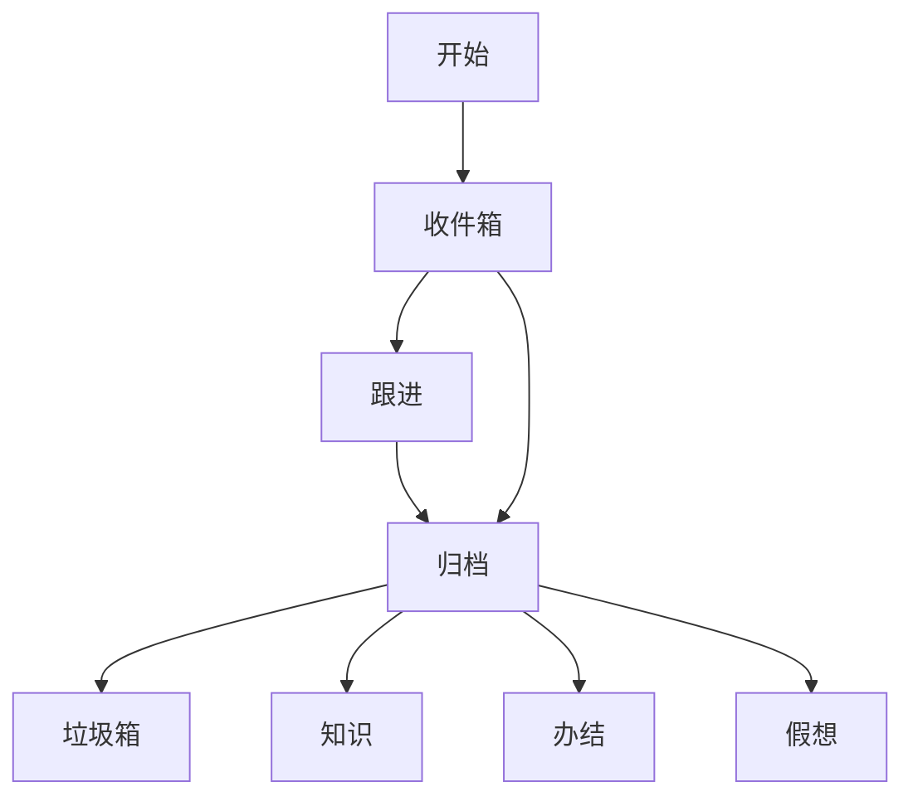

# 使用理念

-   收件箱： 减轻思考成本，记录优先，整理稍后。整理后，事项进入待办以进行跟进。
-   待办： 正在执行，计划要执行的事情，这里的事情都需要解决
-   归档： 已经完成的事项，会进入到此类中
    -   垃圾箱： 收件箱中直接丢弃进入垃圾箱，不需要处理的
    -   想法： 只是一个想法，还没有到可执行的状态
    -   知识： 不需要执行，但是可以作为一个知识点，供后续查阅
-   标签： 通过标签，对事项进行归类管理，可以设置工作流，重要性，提醒等，以方便跟进为目标

## 工作流示意图

